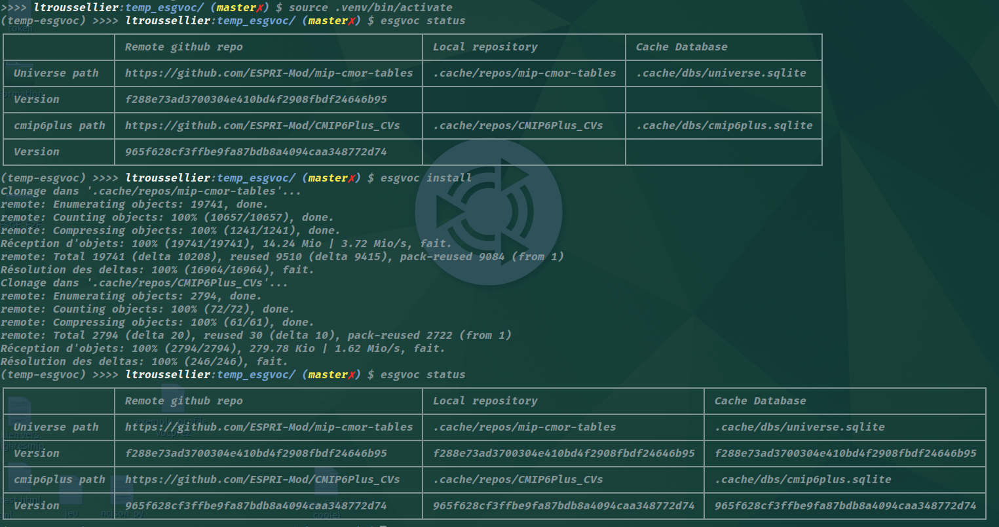

# esgvpoc use cases 


the esgvoc library supports a wide range of use cases, including:
* Caching:
Usage without internet access.
Downloading CVs to a local archive or database.
Updating the local cache.
Performing consistency checks between the local cache and remote CV repositories.
* Listing:
All data descriptors from the Universe.  
All terms of one data descriptor from the Universe.  
All available projects.  
All collections from a project.  
All terms from a project.  
All terms of a collection from a project.  
* Validation:
Validating an input string against:  
All terms of the Universe.  
All terms of a data descriptor from the Universe.  
All terms of a project.  
All terms of a collection from a project.  
All terms from all projects (cross-validation).  
Validation may be case-sensitive or case-insensitive.  
Wildcards can be used in validation queries.  
The system can return one or several valid terms, as well as similar terms if exact matches are not found.
# instalation
## in venv
```bash
pip install esgvoc
```

## activate venv
```bash
source .venv/bin/activate
```


# CLI commands

## esgvoc --help

## esgvoc install
to get the latest CVs
currently, only CMIP6Plus_CV is supported
## esgvoc status
to see the differents CVs version on github, on local, in cached db


## esgvoc get
the idea is : 
```bash
esgvoc get <What_CV>:<What_collection>:<What_term>

```
with somes shortcuts   
you can try:
```bash
esgvoc get ::
esgvoc get universe::
esgvoc get universe:institution:
esgvoc get universe:institution:IPSL

esgvoc get cmip6plus::
esgvoc get cmip6plus:institution_id:
esgvoc get cmip6plus:institution_id:ipsl

esgvoc get cmip6plus:institution_id:ipsl cmip6plus:institution_id:llnl

```

## esgvoc valid

the idea is to validate the DRS_name against a collection or complete CV    
you can try : 

```bash
esgvoc valid IPSL ::
esgvoc valid ipsl ::


esgvoc valid IPSL cmip6plus::
esgvoc valid IPSL cmip6plus:institution_id:

```

## more explanation coming soon

take a look at the the notebook here :
https://github.com/ESPRI-Mod/cmipld/blob/main/basicsEsgvoc.ipynb

