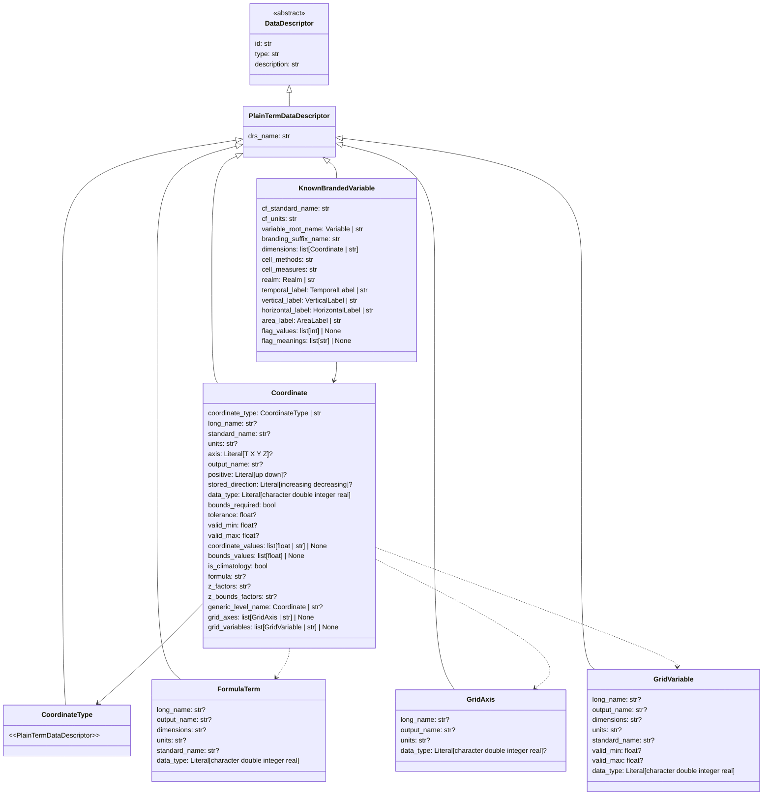

# Coordinate Model Proposal for esgvoc

> **Principle**: esgvoc is a vocabulary service. CMOR tables and QA/QC are *consumers*.
> The data model must contain all the information consumers need, served flat and simple —
> no object-inside-object-inside-object. Consumers should be able to read one record and
> have everything they need.

---

## Class diagram



**Key relationships**: typed references, not opaque strings.

- `KnownBrandedVariable.dimensions` is `list[Coordinate | str]` — in JSON it's stored as
  a list of IDs (`["longitude", "latitude", "time"]`), but the pydantic type makes the
  contract explicit: each entry *is* a Coordinate. esgvoc resolves IDs to full objects
  at query time (same JSON-LD resolution pattern used elsewhere in the codebase).
- `Coordinate.generic_level_name` links parametric verticals to their generic level.
- `Coordinate.z_factors` references `FormulaTerm` entries by name.
- `Coordinate.grid_axes` and `Coordinate.grid_variables` wire `"generic_xy"` coordinates
  to their `GridAxis` index dimensions and `GridVariable` 2-D auxiliary variables.

---

## Pydantic models

### Cross-references to other data descriptors

Several `str` fields in the models below are not free text — they are IDs
referencing terms from other data descriptors in the universe. These should
use the `Model | str` union type to make the relationship explicit:

| Field | On model | References |
|-------|----------|------------|
| `coordinate_type` | Coordinate | `CoordinateType \| str` |
| `generic_level_name` | Coordinate | `Coordinate \| str` |
| `grid_axes` | Coordinate | `list[GridAxis \| str] \| None` |
| `grid_variables` | Coordinate | `list[GridVariable \| str] \| None` |
| `dimensions` | KnownBrandedVariable | `list[Coordinate \| str]` |
| `variable_root_name` | KnownBrandedVariable | `Variable \| str` |
| `realm` | KnownBrandedVariable | `Realm \| str` |
| `temporal_label` | KnownBrandedVariable | `TemporalLabel \| str` |
| `vertical_label` | KnownBrandedVariable | `VerticalLabel \| str` |
| `horizontal_label` | KnownBrandedVariable | `HorizontalLabel \| str` |
| `area_label` | KnownBrandedVariable | `AreaLabel \| str` |

In JSON these are stored as plain string IDs (e.g. `"realm": "atmos"`).
esgvoc resolves each ID to the full referenced object at query time via
JSON-LD reference resolution — same pattern already used for composite terms.
The `Model | str` type makes the contract explicit: this is not free text,
it's a reference to another term.

### Data unification: two types become one

The Data Request currently splits coordinate information across two separate
types: `axis_coordinate` (~68 scalar entries) and `axis_dimension` (~53
dimension entries). This proposal **unifies** them into a single `Coordinate`
model, differentiated by the `coordinate_type` field:

- `axis_coordinate` entries → `coordinate_type = "scalar"` (all ~68 are scalar coordinates)
- `axis_dimension` entries → `coordinate_type` assigned based on structure (standard, generic_vertical, climatological, auxiliary, generic_xy, site)

**Why unify?** Consumers don't care whether the Data Request stored a coordinate
in one table or another. They need one model that answers: "what is this
coordinate, and how do I validate it?" The `coordinate_type` field provides
that answer without the consumer needing to know about the historical split.

### Field name mapping

The pydantic model uses clean Python names. At ingestion time, the JSON fields
from the Data Request are mapped to the model fields:

| Pydantic field | Data Request JSON field | Notes |
|---|---|---|
| `output_name` | `out_name` | Renamed for clarity |
| `bounds_required` | `must_have_bounds` | Renamed: bool semantics |
| `coordinate_values` | `value` (scalar) / `requested` (list) | Unified into one field |
| `bounds_values` | `bounds_values` / `requested_bounds` | Unified, parsed from space-separated strings |
| `is_climatology` | `climatology` | Renamed for clarity |
| `coordinate_type` | — (derived) | New field, inferred from source type + structure |
| `type` | — | Set to `"coordinate"` for all entries |

Numeric values stored as strings in the Data Request (e.g., `"100000.0"`,
`"-90"`, `"0."`) are coerced to the appropriate Python type by pydantic.
Space-separated bounds strings (e.g., `"0 100"`) are parsed into `list[float]`
at ingestion time.

### CoordinateType (data descriptor)

`CoordinateType` is a universe collection, not a Python enum. The 7 types are
governed as vocabulary terms — adding or modifying a type is a PR to the
universe repo, not a code change in esgvoc.

```python
class CoordinateType(PlainTermDataDescriptor):
    """
    Classification of coordinates by their structural role in a NetCDF file.

    This tells QA/QC tools *what kind of checking* to apply to each coordinate.
    The classification is based on how the coordinate appears in the file,
    not on its physical meaning (that's what `axis` and `standard_name` are for).

    Each type is a term in the universe `coordinate_type/` collection.
    Coordinate.coordinate_type references these by ID.
    """

    pass
```

**Universe JSON terms** — 7 files in `coordinate_type/`:

```json
{
  "id": "standard",
  "type": "coordinate_type",
  "drs_name": "standard",
  "description": "1-D coordinate variable whose name matches its dimension. The most common type. Examples: plev19, alt16, time, rho, spectband. Also used for parametric vertical coordinates with formulas (e.g. alternate_hybrid_sigma). QA/QC: verify coordinate variable exists with matching dimension, check units/values/bounds if specified, check formula/z_factors if present."
}
```

```json
{
  "id": "scalar",
  "type": "coordinate_type",
  "drs_name": "scalar",
  "description": "Single-valued coordinate listed in the coordinates attribute, not as a dimension. Value can be numeric (depth0m=0.0) or string (typebare='bare_ground'). QA/QC: verify value matches coordinate_values, verify listed in coordinates attribute, check bounds if specified."
}
```

```json
{
  "id": "auxiliary",
  "type": "coordinate_type",
  "drs_name": "auxiliary",
  "description": "Auxiliary 1-D coordinate with a simple index dimension. Values are strings identifying categories (vegetation types, ocean basins). QA/QC: verify character data type, verify auxiliary coordinate variable exists, dimension is a simple index."
}
```

```json
{
  "id": "generic_vertical",
  "type": "coordinate_type",
  "drs_name": "generic_vertical",
  "description": "Abstract model-level vertical coordinate whose values are model-dependent. Only 4 in CMIP7: alevel, olevel, alevhalf, olevhalf. QA/QC: verify dimension exists with output_name 'lev', do NOT check specific level values. Specific parametric coordinates (alternate_hybrid_sigma, etc.) reference these via generic_level_name but are classified as 'standard'."
}
```

```json
{
  "id": "generic_xy",
  "type": "coordinate_type",
  "drs_name": "generic_xy",
  "description": "Longitude and latitude when listed as dimensions. May be 1-D coordinate variables (regular grid) or replaced by index dimensions i, j, k, l, m (unstructured/rotated grids). Use axis field ('X' or 'Y') to distinguish. QA/QC: if regular grid, check like standard; if unstructured, verify grid index dimensions and auxiliary coordinate variables exist."
}
```

```json
{
  "id": "climatological",
  "type": "coordinate_type",
  "drs_name": "climatological",
  "description": "Time coordinate requiring a climatology attribute instead of bounds. QA/QC: verify climatology attribute exists (not bounds), verify climatological cell_methods."
}
```

```json
{
  "id": "site",
  "type": "coordinate_type",
  "drs_name": "site",
  "description": "Site/station data dimension — an integer index with longitude and latitude recorded as auxiliary coordinates in the coordinates attribute. QA/QC: verify lon/lat auxiliary coordinates exist, verify correct length."
}
```

This means:
- `Coordinate.coordinate_type` is `CoordinateType | str` — same pattern as `realm: Realm | str`
- QA/QC dispatches on `coord.coordinate_type` (as string ID: `"standard"`, `"scalar"`, etc.)
- The community can add a new type (e.g. if a future MIP needs one) by adding a JSON file to the universe — no esgvoc code change needed

### Coordinate

```python
from __future__ import annotations

from typing import Literal

from pydantic import Field, model_validator

from esgvoc.api.data_descriptors.data_descriptor import PlainTermDataDescriptor


class Coordinate(PlainTermDataDescriptor):
    """
    A coordinate or dimension definition for climate data files.

    This is the central model for describing how spatial, temporal, and other
    axes are represented in NetCDF files. Each coordinate is a standalone
    vocabulary term identified by its `id` (e.g., "plev19", "latitude", "depth0m").

    Branded variables reference coordinates by ID in their `dimensions` field.
    Consumers (CMOR, QA/QC) look up coordinate details when they need them.

    This model unifies what CMOR tables split across "coordinate", "grids",
    and partial "formula_terms" entries. The `coordinate_type` field tells
    consumers which validation rules apply.

    Covers ~125 coordinate terms (unified from axis_coordinate + axis_dimension
    in the Data Request, plus 4 new generic_vertical entries to be created).
    """

    # ── Classification ──────────────────────────────────────────────────
    # This is the key field for consumers: it determines what kind of
    # checking/generation logic to apply.

    coordinate_type: CoordinateType | str = Field(
        description=(
            "Structural classification of this coordinate. "
            "Determines which QA/QC rules apply and how CMOR tables "
            "represent this coordinate. References a CoordinateType term by ID."
        )
    )

    # ── CF metadata ─────────────────────────────────────────────────────
    # These fields come from CF conventions and the Data Request.
    # They describe what the coordinate *means* physically.

    long_name: str | None = Field(
        default=None,
        description=(
            "Human-readable name. From the Data Request 'Title' column. "
            "Example: 'Pressure Levels (19)', 'Latitude'. "
            "May be overridden by project (e.g., CORDEX vs CMIP may differ)."
        ),
    )

    standard_name: str | None = Field(
        default=None,
        description=(
            "CF standard name from the CF Standard Name Table "
            "(https://cfconventions.org/Data/cf-standard-names/current/build/cf-standard-name-table.html). "
            "Example: 'air_pressure' for plev19, "
            "'latitude' for latitude. None for coordinates without a "
            "CF standard name (e.g., depth0m, site, effectRadIc)."
        ),
    )

    units: str | None = Field(
        default=None,
        description=(
            "CF-compliant units string. Example: 'Pa', 'degrees_north', 'm'. "
            "Special case: 'days since ?' for time coordinates — the reference "
            "date is model/experiment-dependent."
        ),
    )

    axis: Literal["T", "X", "Y", "Z"] | None = Field(
        default=None,
        description=(
            "CF axis identifier. "
            "Used to distinguish longitude from latitude within 'generic_xy' type, "
            "and to identify the time axis. "
            "None for coordinates that don't map to a standard axis (e.g., spectral bands)."
        ),
    )

    # ── File representation ─────────────────────────────────────────────
    # How this coordinate appears in the actual NetCDF file.

    output_name: str | None = Field(
        default=None,
        description=(
            "The variable/dimension name as written in the NetCDF file. "
            "Example: 'lat' for latitude, 'lev' for alevel/olevel, "
            "'plev' for plev19/plev7. Multiple coordinates can share "
            "the same output_name (plev19 and plev7 both write 'plev')."
        ),
    )

    data_type: Literal["character", "double", "integer", "real"] = Field(
        default="double",
        description=(
            "NetCDF data type. "
            "'character' indicates string-valued auxiliary coordinates (e.g., vegtype). "
            "Defaults to 'double' — some parametric verticals in the Data Request "
            "don't specify it explicitly. CMOR tables map this to 'type'."
        )
    )

    positive: Literal["up", "down"] | None = Field(
        default=None,
        description=(
            "Direction of increasing coordinate values. "
            "Only relevant for vertical coordinates (axis='Z'). "
            "Left empty for generic_vertical coordinates (alevel, olevel) "
            "because the sign depends on each model's native vertical coordinate."
        ),
    )

    stored_direction: Literal["increasing", "decreasing"] | None = Field(
        default=None,
        description=(
            "Storage order in file. "
            "Example: pressure levels are typically stored 'decreasing' "
            "(top of atmosphere first), latitude 'increasing' (south to north)."
        ),
    )

    # ── Bounds & validation ─────────────────────────────────────────────

    bounds_required: bool = Field(
        default=False,
        description=(
            "Whether this coordinate must have an associated bounds variable. "
            "True for most dimension coordinates (latitude, time, pressure levels). "
            "False for scalar coordinates and index dimensions. "
            "CMOR tables map this to 'must_have_bounds'."
        ),
    )

    is_climatology: bool = Field(
        default=False,
        description=(
            "If True, this time coordinate uses a 'climatology' attribute "
            "instead of 'bounds'. Only relevant when coordinate_type is 'climatological'. "
            "Kept as explicit field for consumers that need a simple boolean check "
            "without parsing coordinate_type."
        ),
    )

    tolerance: float | None = Field(
        default=None,
        description=(
            "Acceptable deviation from requested coordinate values, in coordinate units. "
            "Used by QA/QC to validate that reported values are close enough to requested. "
            "Example: tolerance=1 for alt16 (altitude within 1 meter)."
        ),
    )

    valid_min: float | None = Field(
        default=None,
        description=(
            "Minimum valid value. Example: -90.0 for latitude. "
            "Used by QA/QC to reject out-of-range data."
        ),
    )

    valid_max: float | None = Field(
        default=None,
        description=(
            "Maximum valid value. Example: 90.0 for latitude. "
            "Used by QA/QC to reject out-of-range data."
        ),
    )

    # ── Coordinate values ───────────────────────────────────────────────
    # These fields specify what values the coordinate should contain.
    # For "scalar" coordinates: a single value (and optionally bounds).
    # For "standard" coordinates: a list of requested values (and optionally bounds).
    # None means "no specific values required" (model-dependent).

    coordinate_values: list[float] | list[str] | float | str | None = Field(
        default=None,
        description=(
            "Expected coordinate values. "
            "Single value (float or str) for 'scalar' coordinates: e.g., 0.0 for depth0m. "
            "List for 'standard' coordinates with requested levels: e.g., [85000, 50000, ...] for plev7. "
            "List of str for 'auxiliary' coordinates: e.g., vegetation type names. "
            "None when values are model-dependent (e.g., time, generic vertical)."
        ),
    )

    bounds_values: list[float] | None = Field(
        default=None,
        description=(
            "Expected bounds values, as a flat list of pairs [lower1, upper1, lower2, upper2, ...]. "
            "For 'scalar' coordinates: the scalar bounds (e.g., [0.0, 100.0] for olayer100m). "
            "For 'standard' coordinates: requested bounds matching coordinate_values. "
            "None when bounds are model-dependent."
        ),
    )

    # ── Formula terms (parametric vertical coordinates) ──────────────────
    # These fields are populated for "standard" coordinates that realize a
    # parametric vertical formula (e.g. alternate_hybrid_sigma, ocean_sigma).
    # Other coordinate types leave these as None.

    formula: str | None = Field(
        default=None,
        description=(
            "Parametric vertical coordinate formula. "
            "Example: 'p = ap + b*ps' for atmosphere_hybrid_sigma_pressure_coordinate. "
            "Only for parametric vertical coordinates ('standard' type with generic_level_name). "
            "CF convention requirement."
        ),
    )

    z_factors: str | None = Field(
        default=None,
        description=(
            "Space-separated list of formula term variables and their names. "
            "Example: 'ap: ap b: b ps: ps'. "
            "Only for parametric vertical coordinates."
        ),
    )

    z_bounds_factors: str | None = Field(
        default=None,
        description=(
            "Same as z_factors but for the bounds variables. "
            "Example: 'ap: ap_bnds b: b_bnds ps: ps'. "
            "Only for parametric vertical coordinates (absent for half-level variants)."
        ),
    )

    generic_level_name: "Coordinate | str | None" = Field(
        default=None,
        description=(
            "The generic level this coordinate belongs to: 'alevel', 'olevel', etc. "
            "References another Coordinate term (one of the 4 'generic_vertical' entries). "
            "Used to link parametric vertical coordinates (like alternate_hybrid_sigma) "
            "to their generic level."
        ),
    )

    # ── Grid support (non-regular grids) ───────────────────────────────
    # These fields are populated for "generic_xy" coordinates (longitude, latitude).
    # On non-regular grids (unstructured, rotated, cubed sphere), geographic
    # coordinates are not simple 1-D axes — they use index dimensions (i, j)
    # described by GridAxis, and 2-D auxiliary coordinate variables described
    # by GridVariable. These fields wire the relationship explicitly so that
    # consumers (QA/QC, CMOR table generation) don't have to discover GridAxis
    # and GridVariable terms by convention — they just follow the references.
    # On regular grids these fields are None (the coordinate works as a plain
    # 1-D axis and no grid indirection is needed).

    grid_axes: "list[GridAxis | str] | None" = Field(
        default=None,
        description=(
            "Grid index dimensions used on non-regular grids. "
            "Example: ['i_index', 'j_index'] for unstructured grids. "
            "Only for 'generic_xy' coordinates. None on regular grids."
        ),
    )

    grid_variables: "list[GridVariable | str] | None" = Field(
        default=None,
        description=(
            "2-D auxiliary coordinate variables providing geographic values "
            "on non-regular grids. "
            "Example: ['latitude', 'longitude'] (as GridVariable terms, not Coordinate terms). "
            "Only for 'generic_xy' coordinates. None on regular grids."
        ),
    )

    def _type_id(self) -> str:
        """Return the coordinate_type as a string ID, whether resolved or not."""
        if isinstance(self.coordinate_type, str):
            return self.coordinate_type
        return self.coordinate_type.id  # resolved CoordinateType object

    @model_validator(mode="after")
    def validate_coordinate_consistency(self) -> "Coordinate":
        """Validate that fields are consistent with the coordinate_type."""
        ct = self._type_id()
        if ct == "scalar":
            if isinstance(self.coordinate_values, list):
                raise ValueError(
                    "scalar coordinates must have a single value, not a list. "
                    f"Got: {self.coordinate_values}"
                )
        if ct == "climatological":
            if not self.is_climatology:
                raise ValueError(
                    "climatological coordinates must have is_climatology=True."
                )
        return self
```

### FormulaTerm

```python
class FormulaTerm(PlainTermDataDescriptor):
    """
    A variable used in parametric vertical coordinate formulas.

    Formula terms are the individual variables (like 'ap', 'b', 'ps', 'orog')
    that appear in CF parametric vertical coordinate formulas.
    Example: in the formula "p = ap + b*ps", the terms are ap, b, and ps.

    These are referenced by Coordinate.z_factors and exist as separate
    NetCDF variables in the output file.

    ~25 formula terms extracted from the Data Request.
    """

    long_name: str | None = Field(
        default=None,
        description=(
            "Human-readable name. "
            "Example: 'vertical coordinate formula term: ap'."
        ),
    )

    output_name: str | None = Field(
        default=None,
        description=(
            "Variable name as written in the NetCDF file. "
            "Example: 'a', 'b', 'ps', 'orog'."
        ),
    )

    dimensions: str | None = Field(
        default=None,
        description=(
            "Space-separated dimension names for this variable. "
            "Example: 'alevel' for a level-dependent term, "
            "'latitude longitude' for a surface field like orog."
        ),
    )

    units: str | None = Field(
        default=None,
        description="CF units. Example: '1' (dimensionless), 'Pa', 'm'.",
    )

    standard_name: str | None = Field(
        default=None,
        description=(
            "CF standard name from the CF Standard Name Table. "
            "Most formula terms (a, b, ap, etc.) don't have one — "
            "only physical variables like ps, p0, orog, depth do."
        ),
    )

    data_type: Literal["character", "double", "integer", "real"] = Field(
        description="NetCDF data type.",
    )
```

### GridAxis and GridVariable

```python
class GridAxis(PlainTermDataDescriptor):
    """
    An index dimension used for unstructured or non-standard grids.

    When a variable uses a non-regular grid (e.g., cubed sphere, unstructured mesh),
    the spatial dimensions are simple indices (i, j, k, l, m) rather than
    geographic coordinates.

    ~12 grid axes extracted from the Data Request.
    """

    long_name: str | None = Field(
        default=None,
        description=(
            "Human-readable name. "
            "Example: 'first spatial index for variables stored on an unstructured grid'."
        ),
    )

    output_name: str | None = Field(
        default=None,
        description="Index variable name in the NetCDF file. Example: 'i', 'j', 'k'.",
    )

    units: str | None = Field(
        default=None,
        description="Usually '1' (dimensionless index).",
    )

    data_type: Literal["character", "double", "integer", "real"] | None = Field(
        default=None,
        description=(
            "NetCDF data type. Typically 'integer' for indices. "
            "None for abstract axes like 'vertices' that have no data."
        ),
    )


class GridVariable(PlainTermDataDescriptor):
    """
    A 2-D geographic coordinate variable for non-regular grids.

    When a model uses an unstructured or rotated grid, the actual
    longitude/latitude values are stored as 2-D auxiliary coordinate
    variables (functions of the grid indices).

    Examples: latitude(i,j), longitude(i,j), vertices_latitude(i,j,vertices).

    4 grid variables extracted from the Data Request.
    """

    long_name: str | None = Field(
        default=None,
        description="Human-readable name. Example: 'latitude'.",
    )

    output_name: str | None = Field(
        default=None,
        description=(
            "Variable name in the NetCDF file. "
            "Example: 'latitude', 'longitude', 'vertices_latitude'."
        ),
    )

    dimensions: str | None = Field(
        default=None,
        description=(
            "Space-separated dimension names. "
            "Example: 'longitude latitude' for 2-D geographic variables."
        ),
    )

    units: str | None = Field(
        default=None,
        description="CF units. Example: 'degrees_north', 'degrees_east'.",
    )

    standard_name: str | None = Field(
        default=None,
        description="CF standard name from the CF Standard Name Table. Example: 'latitude', 'longitude'.",
    )

    valid_min: float | None = Field(default=None, description="Minimum valid value.")
    valid_max: float | None = Field(default=None, description="Maximum valid value.")

    data_type: Literal["character", "double", "integer", "real"] = Field(
        description="NetCDF data type. Typically 'double'.",
    )
```

### KnownBrandedVariable (updated)

```python
class KnownBrandedVariable(PlainTermDataDescriptor):
    """
    A climate variable with full sampling/branding metadata.

    This is the main "product" esgvoc serves to consumers.
    The `dimensions` field is a list of Coordinate IDs — look them up
    by ID to get the full coordinate metadata.
    """

    # ── CF context ──────────────────────────────────────────────────────

    cf_standard_name: str = Field(
        description="CF standard name. Example: 'air_temperature'.",
    )

    cf_units: str = Field(
        description="CF units. Example: 'K', 'kg m-2 s-1'.",
    )

    # ── Variable decomposition ──────────────────────────────────────────

    variable_root_name: Variable | str = Field(
        description=(
            "Root variable name (before branding). Example: 'ta', 'pr'. "
            "References a Variable term in the universe. "
            "Stored as string ID in JSON, resolved to full object at query time."
        ),
    )

    branding_suffix_name: str = Field(
        description=(
            "Branding suffix. Example: 'tavg-p19-hxy-air'. "
            "Encodes temporal/vertical/horizontal/area sampling."
        ),
    )

    # ── Dimensions ──────────────────────────────────────────────────────

    dimensions: list[Coordinate | str] = Field(
        description=(
            "Ordered list of coordinates that define this variable's axes. "
            "Example: ['longitude', 'latitude', 'plev19', 'time']. "
            "In JSON, stored as string IDs. esgvoc resolves each ID to a full "
            "Coordinate object at query time via JSON-LD reference resolution. "
            "The union type makes the contract explicit: each entry IS a Coordinate. "
            "Order matters: matches the NetCDF dimension order."
        ),
    )

    # ── Cell methods & measures ─────────────────────────────────────────

    cell_methods: str = Field(
        default="",
        description=(
            "CF cell_methods string. Example: 'area: time: mean'. "
            "Describes the statistical processing applied along each axis."
        ),
    )

    cell_measures: str = Field(
        default="",
        description=(
            "CF cell_measures string. Example: 'area: areacella'. "
            "Identifies the measure variables (cell areas, volumes)."
        ),
    )

    # ── Sampling labels ─────────────────────────────────────────────────

    realm: Realm | str = Field(
        description=(
            "Earth system realm. Example: 'atmos', 'ocean', 'land'. "
            "References a Realm term. May be overridden by project."
        ),
    )

    temporal_label: TemporalLabel | str = Field(
        description=(
            "Temporal sampling label. Example: 'tavg' (time average), 'tpt' (point). "
            "References a TemporalLabel term."
        ),
    )

    vertical_label: VerticalLabel | str = Field(
        description=(
            "Vertical sampling label. Example: 'p19' (19 pressure levels), 'h2m' (2m height). "
            "References a VerticalLabel term."
        ),
    )

    horizontal_label: HorizontalLabel | str = Field(
        description=(
            "Horizontal sampling label. Example: 'hxy' (horizontal grid). "
            "References a HorizontalLabel term."
        ),
    )

    area_label: AreaLabel | str = Field(
        description=(
            "Area type label. Example: 'air' (air), 'sea' (sea surface), 'u' (unspecified). "
            "References an AreaLabel term."
        ),
    )

    # ── Flag variables (categorical/discrete data) ──────────────────────

    flag_values: list[int] | None = Field(
        default=None,
        description=(
            "Integer flag values for categorical variables. "
            "Example: [0, 1, 2, 3] for sea_ice_category. "
            "Must have same length as flag_meanings. "
            "None for non-categorical variables."
        ),
    )

    flag_meanings: list[str] | None = Field(
        default=None,
        description=(
            "Human-readable meanings for each flag value. "
            "Example: ['open_water', 'sea_ice', 'land', 'missing']. "
            "Must have same length as flag_values."
        ),
    )
```

---

## Concrete examples: classic and exotic

### Coordinate examples

**Classic — `latitude` ("generic_xy")**:
```json
{
  "id": "latitude",
  "type": "coordinate",
  "drs_name": "latitude",
  "description": "Latitude",
  "coordinate_type": "generic_xy",
  "long_name": "Latitude",
  "standard_name": "latitude",
  "units": "degrees_north",
  "axis": "Y",
  "output_name": "lat",
  "stored_direction": "increasing",
  "data_type": "double",
  "bounds_required": true,
  "valid_min": -90.0,
  "valid_max": 90.0,
  "grid_axes": ["i_index", "j_index"],
  "grid_variables": ["latitude", "longitude"]
}
```

> **Note**: `grid_axes` and `grid_variables` are only relevant on non-regular grids.
> On regular grids these are `null` — the coordinate works as a plain 1-D axis.
> The `grid_variables` reference GridVariable terms (2-D auxiliary variables),
> not Coordinate terms — even though they share the same IDs.

**Classic — `plev19` ("standard" with requested values)**:
```json
{
  "id": "plev19",
  "type": "coordinate",
  "drs_name": "plev19",
  "description": "19 pressure levels",
  "coordinate_type": "standard",
  "long_name": "Pressure Levels (19)",
  "standard_name": "air_pressure",
  "units": "Pa",
  "axis": "Z",
  "output_name": "plev",
  "positive": "down",
  "stored_direction": "decreasing",
  "data_type": "double",
  "bounds_required": false,
  "coordinate_values": [100000.0, 92500.0, 85000.0, 70000.0, 60000.0, 50000.0, 40000.0,
    30000.0, 25000.0, 20000.0, 15000.0, 10000.0, 7000.0, 5000.0, 3000.0, 2000.0, 1000.0, 500.0, 100.0]
}
```

**Classic — `time` ("standard", model-dependent values)**:
```json
{
  "id": "time",
  "type": "coordinate",
  "drs_name": "time",
  "description": "Time Intervals",
  "coordinate_type": "standard",
  "standard_name": "time",
  "units": "days since ?",
  "axis": "T",
  "output_name": "time",
  "stored_direction": "increasing",
  "data_type": "double",
  "bounds_required": true,
  "is_climatology": false
}
```

**Exotic — `depth0m` ("scalar", numeric value)**:
```json
{
  "id": "depth0m",
  "type": "coordinate",
  "drs_name": "depth0m",
  "description": "Scalar coordinate: Ocean Surface Coordinate",
  "coordinate_type": "scalar",
  "long_name": "Ocean Surface Coordinate",
  "units": "m",
  "axis": "Z",
  "output_name": "seasurface",
  "positive": "down",
  "stored_direction": "increasing",
  "data_type": "double",
  "bounds_required": false,
  "coordinate_values": 0.0
}
```

**Exotic — `typebare` ("scalar", string value)**:
```json
{
  "id": "typebare",
  "type": "coordinate",
  "drs_name": "typebare",
  "description": "Scalar coordinate: surface type bare_ground",
  "coordinate_type": "scalar",
  "long_name": "surface type",
  "standard_name": "area_type",
  "units": "1",
  "output_name": "type",
  "data_type": "character",
  "bounds_required": false,
  "coordinate_values": "bare_ground"
}
```

**Exotic — `vegtype` ("auxiliary", string categories)**:
```json
{
  "id": "vegtype",
  "type": "coordinate",
  "drs_name": "vegtype",
  "description": "Auxiliary coordinate: Vegetation or Land Cover Type",
  "coordinate_type": "auxiliary",
  "long_name": "Vegetation or Land Cover Type",
  "standard_name": "area_type",
  "units": "1",
  "output_name": "type",
  "data_type": "character",
  "bounds_required": false
}
```

**Exotic — `time2` ("climatological")**:
```json
{
  "id": "time2",
  "type": "coordinate",
  "drs_name": "time2",
  "description": "Monthly Climatology time axis",
  "coordinate_type": "climatological",
  "long_name": "Monthly Climatology",
  "standard_name": "time",
  "units": "days since ?",
  "axis": "T",
  "output_name": "time",
  "stored_direction": "increasing",
  "data_type": "double",
  "bounds_required": true,
  "is_climatology": true
}
```

**Exotic — `alevel` ("generic_vertical", abstract placeholder — to be created)**:

> Note: alevel, olevel, alevhalf, olevhalf do not exist as separate entries in
> the current Data Request extraction. They are referenced by `generic_level_name`
> in parametric verticals but need to be created as explicit Coordinate terms.

```json
{
  "id": "alevel",
  "type": "coordinate",
  "drs_name": "alevel",
  "description": "Generic atmosphere model level coordinate",
  "coordinate_type": "generic_vertical",
  "units": "1",
  "axis": "Z",
  "output_name": "lev",
  "data_type": "double",
  "bounds_required": true
}
```

**Exotic — `alternate_hybrid_sigma` ("standard" with formula, links to alevel)**:
```json
{
  "id": "alternate_hybrid_sigma",
  "type": "coordinate",
  "drs_name": "alternate_hybrid_sigma",
  "description": "Parametric: hybrid sigma pressure coordinate",
  "coordinate_type": "standard",
  "long_name": "hybrid sigma pressure coordinate",
  "standard_name": "atmosphere_hybrid_sigma_pressure_coordinate",
  "units": "1",
  "axis": "Z",
  "output_name": "lev",
  "positive": "down",
  "stored_direction": "decreasing",
  "data_type": "double",
  "bounds_required": true,
  "valid_min": 0.0,
  "valid_max": 1.0,
  "formula": "p = ap + b*ps",
  "z_factors": "ap: ap b: b ps: ps",
  "z_bounds_factors": "ap: ap_bnds b: b_bnds ps: ps",
  "generic_level_name": "alevel"
}
```

**Exotic — `site` ("site")**:
```json
{
  "id": "site",
  "type": "coordinate",
  "drs_name": "site",
  "description": "Site/station index dimension",
  "coordinate_type": "site",
  "long_name": "site index",
  "units": "1",
  "output_name": "site",
  "data_type": "integer",
  "bounds_required": false
}
```

### FormulaTerm example

```json
{
  "id": "ap",
  "type": "formula_term",
  "drs_name": "ap",
  "description": "vertical coordinate formula term: ap",
  "long_name": "vertical coordinate formula term: ap",
  "output_name": "ap",
  "dimensions": "alevel",
  "units": "Pa",
  "data_type": "double"
}
```

### GridAxis example

```json
{
  "id": "i_index",
  "type": "grid_axis",
  "drs_name": "i_index",
  "description": "First spatial index for unstructured grid",
  "long_name": "first spatial index for variables stored on an unstructured grid",
  "output_name": "i",
  "units": "1",
  "data_type": "integer"
}
```

### GridVariable example

> **ID collision note**: `latitude` and `longitude` exist as both Coordinate
> terms (from `axis_dimension/`) and GridVariable terms. The `type` field
> differentiates them (`"coordinate"` vs `"grid_variable"`), and they live in
> separate universe collections, so there is no collision in practice. Consumers
> use the `type` to distinguish which one they need.

```json
{
  "id": "latitude",
  "type": "grid_variable",
  "drs_name": "latitude",
  "description": "2-D latitude for non-regular grids",
  "long_name": "latitude",
  "output_name": "latitude",
  "dimensions": "longitude latitude",
  "units": "degrees_north",
  "standard_name": "latitude",
  "valid_min": -90.0,
  "valid_max": 90.0,
  "data_type": "double"
}
```

### KnownBrandedVariable example

**Classic — `tas_tavg-h2m-hxy-air`**:
```json
{
  "id": "tas_tavg-h2m-hxy-air",
  "type": "known_branded_variable",
  "drs_name": "tas_tavg-h2m-hxy-air",
  "description": "Near-surface air temperature",
  "cf_standard_name": "air_temperature",
  "cf_units": "K",
  "variable_root_name": "tas",
  "branding_suffix_name": "tavg-h2m-hxy-air",
  "dimensions": ["longitude", "latitude", "height2m", "time"],
  "cell_methods": "area: time: mean",
  "cell_measures": "area: areacella",
  "realm": "atmos",
  "temporal_label": "tavg",
  "vertical_label": "h2m",
  "horizontal_label": "hxy",
  "area_label": "air"
}
```

**Exotic — variable with flag values**:
```json
{
  "id": "sftof_fx-u-hxy-sea",
  "type": "known_branded_variable",
  "drs_name": "sftof_fx-u-hxy-sea",
  "description": "Sea area percentage",
  "cf_standard_name": "sea_area_fraction",
  "cf_units": "%",
  "variable_root_name": "sftof",
  "branding_suffix_name": "fx-u-hxy-sea",
  "dimensions": ["longitude", "latitude"],
  "cell_methods": "area: mean",
  "cell_measures": "area: areacello",
  "realm": "ocean",
  "temporal_label": "fx",
  "vertical_label": "u",
  "horizontal_label": "hxy",
  "area_label": "sea",
  "flag_values": [0, 1],
  "flag_meanings": ["land", "ocean"]
}
```

---

## Consumer use cases

### Use case 1: CMOR table generation

**Goal**: generate `CMIP7_coordinate.json` from esgvoc data.

```
Consumer asks esgvoc:
  "Give me all Coordinate terms"

esgvoc returns ~125 flat Coordinate objects.

Consumer maps fields to CMOR format:
  ┌────────────────────────┬──────────────────────────────────┐
  │ CMOR key               │ esgvoc Coordinate field          │
  ├────────────────────────┼──────────────────────────────────┤
  │ "axis"                 │ axis                             │
  │ "long_name"            │ long_name                        │
  │ "must_have_bounds"     │ bounds_required (bool → "yes"/"")│
  │ "out_name"             │ output_name                      │
  │ "standard_name"        │ standard_name                    │
  │ "positive"             │ positive                         │
  │ "stored_direction"     │ stored_direction                 │
  │ "tolerance"            │ tolerance                        │
  │ "type"                 │ data_type                        │
  │ "units"                │ units                            │
  │ "valid_max"            │ valid_max                        │
  │ "valid_min"            │ valid_min                        │
  │ "climatology"          │ is_climatology (bool → "yes"/"") │
  │ "formula"              │ formula (or "")                  │
  │ "generic_level_name"   │ generic_level_name (or "")       │
  │ "z_factors"            │ z_factors (or "")                │
  │ "z_bounds_factors"     │ z_bounds_factors (or "")         │
  │ "requested"            │ coordinate_values (if list)      │
  │ "value"                │ coordinate_values (if scalar)    │
  │ "requested_bounds"     │ bounds_values (if list coord)    │
  │ "bounds_values"        │ bounds_values (if scalar coord)  │
  └────────────────────────┴──────────────────────────────────┘

The mapping is a ~20-line dict. No deep traversal needed.
One Coordinate object → one CMOR entry. Done.
```

**Formula terms** are fetched separately and appended to the CMOR table
(they have their own section with `formula`, `z_factors`, etc.).
No circular dependency — esgvoc serves the data, CMOR formats it.

### Use case 2: QA/QC file validation (cc-plugin / Sol's checker)

**Goal**: given a NetCDF file claiming to contain variable `tas_tavg-h2m-hxy-air`,
verify all its coordinates are correct.

```
Step 1: Look up the branded variable
  → esgvoc.get("tas_tavg-h2m-hxy-air")
  → returns KnownBrandedVariable with dimensions: ["longitude", "latitude", "height2m", "time"]

Step 2: For each dimension, look up the coordinate
  → esgvoc.get("longitude") → Coordinate(coordinate_type="generic_xy", axis="X", ...)
  → esgvoc.get("latitude")  → Coordinate(coordinate_type="generic_xy", axis="Y", ...)
  → esgvoc.get("height2m")  → Coordinate(coordinate_type="scalar", coordinate_values=2.0, units="m", ...)
  → esgvoc.get("time")      → Coordinate(coordinate_type="standard", axis="T", ...)

Step 3: Dispatch on coordinate_type — one switch, no guessing

  match coord.coordinate_type:  # string ID or resolved CoordinateType.id

      case "standard":
          # Check: dimension exists, coordinate variable exists with same name
          # Check: units match coord.units
          # Check: values within [valid_min, valid_max]
          # Check: if coordinate_values set, actual values match within tolerance
          # Check: if bounds_required, bounds variable exists
          # Check: if bounds_values set, actual bounds match
          # If coord.formula is set (parametric vertical, e.g. alternate_hybrid_sigma):
          #   - Check: formula attribute matches coord.formula
          #   - Check: z_factors variables exist as NetCDF variables (→ FormulaTerm)
          #   - Check: generic_level_name dimension exists

      case "scalar":
          # Check: NO dimension for this coordinate
          # Check: variable listed in file's `coordinates` attribute
          # Check: scalar value matches coord.coordinate_values
          # Check: if bounds_values set, bounds match
          # Check: units match

      case "auxiliary":
          # Check: dimension exists (simple index)
          # Check: auxiliary coordinate variable exists (string type)
          # Check: data_type is "character"
          # Check: listed in `coordinates` attribute

      case "generic_vertical":
          # These are abstract placeholders (alevel, olevel, alevhalf, olevhalf)
          # They have NO formula, NO z_factors — those live on realizations
          # (alternate_hybrid_sigma etc.) which are classified as "standard"
          # Check: dimension exists with output_name (e.g., "lev")
          # Do NOT check specific level values (model-dependent)
          # The model declares which realization it uses in EMD metadata

      case "generic_xy":
          # Check: if coord.grid_axes is None → regular grid, treat like "standard"
          # Check: if coord.grid_axes is set → non-regular grid:
          #   - verify index dimensions from coord.grid_axes exist (i, j)
          #   - verify 2-D aux coordinate variables from coord.grid_variables exist
          # Use coord.axis to distinguish X from Y
          # No discovery needed — GridAxis and GridVariable are wired in

      case "climatological":
          # Check: like "standard", but `climatology` attribute instead of `bounds`
          # Check: cell_methods includes climatological processing

      case "site":
          # Check: site dimension exists
          # Check: lon/lat auxiliary coordinates in `coordinates` attribute
```

**The key point**: `coordinate_type` is a direct dispatch key. The QA/QC tool
doesn't need to reverse-engineer the coordinate classification from a combination
of `axis`, `data_type`, `out_name`, and `value` fields. It reads one field
and knows what to do.

### Use case 3: building a variable's complete metadata (data publication)

**Goal**: a data producer wants to know exactly what attributes to write for
variable `abs550oa_tavg-u-hxy-u`.

```
Step 1: Get the branded variable
  → dimensions: ["longitude", "latitude", "time", "lambda550nm"]
  → cell_methods: "area: time: mean"
  → cf_standard_name: "atmosphere_absorption_optical_thickness_..."
  → cf_units: "1"

Step 2: For each dimension, one lookup gives everything needed:
  → "lambda550nm": Coordinate(
        coordinate_type="scalar",
        output_name="wavelength",
        coordinate_values=550.0,
        units="nm",
        standard_name="radiation_wavelength",
        bounds_required=False
    )

The producer now knows:
  - lambda550nm goes in the `coordinates` attribute (it's "scalar")
  - Write it as a scalar variable named "wavelength" with value 550.0
  - Units are "nm", standard_name is "radiation_wavelength"
  - No bounds needed

All from one flat object. No nesting, no cross-referencing multiple tables.
```

---

## Universe vs. Project: how it works (already built into esgvoc)

```
Universe JSON (shared defaults)          Project JSON (overrides)
┌─────────────────────────────┐         ┌───────────────────────┐
│ id: "latitude"              │         │ id: "latitude"        │
│ coordinate_type: "generic_xy│         │ long_name: "Latitude" │◄── project provides
│ axis: "Y"                   │         │ valid_min: -90.0      │    concrete values
│ units: "degrees_north"      │         │ valid_max: 90.0       │
│ data_type: "double"         │         └───────────────────────┘
│ bounds_required: true       │                    │
│ long_name: null  ◄── optional in universe        │
│ valid_min: null  ◄── optional in universe        │
└─────────────────────────────┘                    │
              │                                    │
              └──────────┬─────────────────────────┘
                         ▼
               ┌──────────────────┐
               │ MERGED RESULT    │
               │ (pydantic model  │
               │  validates this) │
               │                  │
               │ All fields set.  │
               │ Project wins on  │
               │ conflicts.       │
               └──────────────────┘
```

**No new mechanism needed for the split itself.** Fields that are `Optional` (with
`None` default) in the pydantic model can be left null in universe JSON and filled
by project JSON. esgvoc already merges universe + project at ingestion time.

### Enforcing project-required fields (possibility, not decided)

Since CV repos use esgvoc as their validation layer, we *could* add a way to say
"this field is optional in the universe, but must not be None after merge with a
project." A `cv_specs.yaml` in each project repo (following the `drs_specs.yaml`,
`attr_specs.yaml` pattern) could declare per-collection required fields:

```yaml
# Possible cv_specs.yaml — per-project validation policy
coordinate:
  required_fields: [long_name, valid_min, valid_max]
known_branded_variable:
  required_fields: [realm, cell_measures, description]
```

However, the QA/QC tool (cc-plugin-wcrp) already handles per-project validation
policy through its own TOML configuration files. Today those TOMLs manually
duplicate the data that esgvoc should serve:

```toml
# cc-plugin-wcrp/plugins/cmip6/config/wcrp/coordinate_variables.toml
# This is MANUAL DUPLICATION of esgvoc Coordinate data:

[coordinates.latitude.attributes.axis]
constant = "Y"                    # ← this IS coord.axis
severity = "M"

[coordinates.latitude.attributes.standard_name]
constant = "latitude"             # ← this IS coord.standard_name
severity = "H"

[coordinates.latitude.attributes.units]
constant = "degrees_north"        # ← this IS coord.units
severity = "H"
```

With the Coordinate model proposed here, cc-plugin could **auto-generate** its
coordinate checks from esgvoc data + a minimal per-project severity config.
The TOML hardcoding of `constant = "latitude"` becomes unnecessary — that data
lives in esgvoc.

So the "required fields" question may be better answered by the QA/QC layer
consuming esgvoc data, rather than adding a new specs file to esgvoc itself.
This is an open discussion point — both approaches work, and they're not
mutually exclusive.

---

## Edge case analysis

Every edge case raised in the discussion (WCRP-universe #246), tested against real
data from `temp_file/generated_terms/`.

### Edge case 1: `depth_coord` / `olevel` — Sol's concern about `"generic_vertical"`

**The problem**: Sol pointed out that `depth_coord` (role: vertical, representation:
dimension_coordinate) is a regular depth axis with real values, not a parametric
coordinate — yet it has `generic_level_name: "olevel"`. Should it be `"generic_vertical"`?

**Real data**:
```json
// depth_coord.json — a plain depth axis, no formula
{
  "id": "depth_coord",
  "out_name": "lev",
  "units": "m",
  "standard_name": "depth",
  "axis": "Z",
  "positive": "down",
  "generic_level_name": "olevel",   // ← links to the generic level
  "must_have_bounds": true
  // NO formula, NO z_factors
}
```

**Classification**: `coordinate_type = "standard"`, not `"generic_vertical"`.

**Why it works**: `depth_coord` has no `formula` or `z_factors` — it's a real
coordinate with actual depth values. The `generic_level_name: "olevel"` field
tells consumers "this is one possible realization of the olevel generic level",
but the coordinate itself is a plain 1-D coordinate. QA/QC treats it like any
`"standard"` coordinate (check values, bounds, units).

The `"generic_vertical"` type is reserved for the 4 abstract levels (alevel, olevel,
alevhalf, olevhalf) that *have no values of their own* — they're just a declaration
that "some model-level vertical coordinate will go here."

**Key insight**: `generic_level_name` and `coordinate_type` are orthogonal.
`generic_level_name` says "I belong to this family." `coordinate_type` says
"here's how to validate me."

### Edge case 2: `alternate_hybrid_sigma` / `modified_sleve` — parametric verticals

**The problem**: Sol raised concern about `modified_sleve_model/half_level` case
(role: vertical, representation: index_coordinate). These are model-specific
parametric vertical coordinates with formulas.

**Real data**:
```json
// alternate_hybrid_sigma.json — has formula + z_factors
{
  "id": "alternate_hybrid_sigma",
  "out_name": "lev",
  "standard_name": "atmosphere_hybrid_sigma_pressure_coordinate",
  "formula": "p = ap + b*ps",
  "z_factors": "ap: ap b: b ps: ps",
  "z_bounds_factors": "ap: ap_bnds b: b_bnds ps: ps",
  "generic_level_name": "alevel",
  "must_have_bounds": true
}
```

**Classification**: `coordinate_type = "standard"` (not `"generic_vertical"`).

**Why**: `alternate_hybrid_sigma` is a *specific* parametric vertical coordinate
that a model declares it uses. It has a concrete formula, concrete z_factors,
and a concrete standard_name. It's not the generic "alevel" placeholder — it's
one of the ~12 possible realizations of "alevel". QA/QC validates:
- `formula` attribute matches `coord.formula`
- `z_factors` variables exist as separate NetCDF variables (→ FormulaTerm)
- bounds exist if `bounds_required` is true

The `formula` and `z_factors` fields on the Coordinate model handle this directly.
No need for `"generic_vertical"` here — that type only applies to the 4 abstract
generic levels themselves.

**The full picture for vertical coordinates**:
```
alevel ("generic_vertical")         ← abstract placeholder, no formula
  ├── alternate_hybrid_sigma ("standard")  ← formula: "p = ap + b*ps"
  ├── standard_hybrid_sigma ("standard")   ← formula: "p = a*p0 + b*ps"
  ├── standard_sigma ("standard")          ← formula: "p = ptop + sigma*(ps - ptop)"
  ├── hybrid_height ("standard")           ← formula: "z = a + b*orog"
  └── ... (other parametric types)

olevel ("generic_vertical")         ← abstract placeholder, no formula
  ├── depth_coord ("standard")             ← plain depth, no formula
  ├── ocean_sigma ("standard")             ← formula: "z(n,k,j,i) = eta + sigma*(depth+eta)"
  ├── ocean_sigma_z ("standard")           ← formula with sigma/z hybrid
  └── ... (other ocean vertical types)
```

Each model picks ONE specific coordinate for alevel and ONE for olevel. The model
declares which one in its EMD metadata. QA/QC then validates accordingly.

### Edge case 3: `time2` / `time3` / `time4` — climatological time coordinates

**The problem**: Karl initially proposed `is_climatology` as a boolean, then
suggested replacing it with a `climatological_time_coordinate` type. Sol counter-
proposed just using `time_coordinate` or even `1-d_coordinate` + `axis="T"` + flag.

**Real data**:
```json
// time2.json — Monthly Climatology
{
  "id": "time2",
  "out_name": "time",
  "standard_name": "time",
  "axis": "T",
  "climatology": true,          // ← the key flag
  "must_have_bounds": true
}

// time4.json — Monthly Mean Daily Statistics (also climatological)
{
  "id": "time4",
  "out_name": "time",
  "standard_name": "time",
  "axis": "T",
  "climatology": true,          // ← same flag
  "must_have_bounds": true
}

// time.json — regular time (no climatology)
{
  "id": "time",
  "out_name": "time",
  "standard_name": "time",
  "axis": "T",
  "must_have_bounds": true
  // no climatology field
}
```

**Classification**:
- `time` → `coordinate_type = "standard"` (regular time axis)
- `time2`, `time3`, `time4` → `coordinate_type = "climatological"` (3 total)

**Why `"climatological"` as a separate type**: The QA/QC validation is *structurally
different* — you check for a `climatology` attribute instead of `bounds`, and
verify climatological cell_methods. This isn't just a flag on a regular time
coordinate — it changes the entire validation path. Having it as a type makes
the consumer's dispatch clean.

**We keep `is_climatology` as a redundant boolean** for consumers who just want
a quick check without parsing coordinate_type. The model_validator enforces consistency.

### Edge case 4: `typebare` / `typesi` — string-valued scalar coordinates

**The problem**: Can `coordinate_values` handle both numeric and string values?

**Real data**:
```json
// typebare.json — scalar coordinate with STRING value
{
  "id": "typebare",
  "out_name": "type",
  "standard_name": "area_type",
  "value": "bare_ground",     // ← string, not number
  "data_type": "character",
  "must_have_bounds": false
}

// depth0m.json — scalar coordinate with NUMERIC value
{
  "id": "depth0m",
  "out_name": "seasurface",
  "value": "0.",              // ← numeric
  "data_type": "double",
  "must_have_bounds": false
}
```

**Classification**: both are `coordinate_type = "scalar"`.

**How the model handles it**: `coordinate_values: list[float] | list[str] | float | str | None`
covers all cases. The `data_type` field ("character" vs "double") tells the consumer
how to interpret the value. The pydantic validator enforces that `"scalar"` coordinates
have a single value, not a list.

### Edge case 5: `vegtype` / `basin` — auxiliary string-valued dimensions

**The problem**: These are index dimensions with string auxiliary coordinates
(vegetation types, ocean basins). How do they differ from scalar string coords?

**Real data**:
```json
// vegtype.json — dimension with string auxiliary coordinate
{
  "id": "vegtype",
  "out_name": "type",
  "standard_name": "area_type",
  "data_type": "character",       // ← key: character = auxiliary
  "must_have_bounds": false
  // NO value field → it's a dimension, not scalar
}
```

**Classification**: `coordinate_type = "auxiliary"`.

**How QA/QC uses it**: The `data_type = "character"` + absence of `coordinate_values`
tells QA/QC to check for a string-valued auxiliary coordinate variable (named by
`output_name`) that describes categories, with the dimension being a simple index.

**Difference from `"scalar"` string coords (typebare)**: typebare has a `value`
("bare_ground") — it's a single fixed value in the `coordinates` attribute.
vegtype has NO value — it's a dimension with multiple categories that the model
chooses.

### Edge case 6: `site` — site/station data

**The problem**: Sol asked why not just use `1-d_coordinate` for site.

**Real data**:
```json
// site.json
{
  "id": "site",
  "out_name": "site",
  "units": "1",
  "data_type": "integer",
  "must_have_bounds": false
}
```

**Classification**: `coordinate_type = "site"`.

**Why a separate type**: Site data requires specific auxiliary coordinates
(longitude, latitude for each site) in the `coordinates` attribute. This is a
structural requirement that `"standard"` doesn't capture — `"standard"` coordinates have
their own dimension+values. Site coordinates are integer indices where the
geographic information lives elsewhere. QA/QC needs to know to check for
auxiliary lon/lat variables.

### Edge case 7: `longitude` / `latitude` — regular vs. unstructured grids

**The problem**: On a regular grid, longitude/latitude are 1-D coordinates.
On an unstructured grid, they become index dimensions (i, j) with 2-D auxiliary
geographic variables.

**Real data**:
```json
// longitude.json (axis_dimension)
{
  "id": "longitude",
  "out_name": "lon",
  "axis": "X",
  "units": "degrees_east",
  "standard_name": "longitude",
  "valid_min": "0", "valid_max": "360",
  "must_have_bounds": true
}

// i_index.json (grid_axis — replaces longitude on unstructured grids)
{
  "id": "i_index",
  "out_name": "i",
  "units": "1",
  "data_type": "integer"
}

// latitude.json (grid_variable — 2D aux coord on unstructured grids)
{
  "id": "latitude",
  "type": "grid_variable",
  "dimensions": "longitude latitude",
  "standard_name": "latitude"
}
```

**Classification**: `longitude` and `latitude` → `coordinate_type = "generic_xy"`.

**How it's wired**: The `longitude` Coordinate has:
- `grid_axes: ["i_index", "j_index"]` — references to GridAxis terms
- `grid_variables: ["longitude", "latitude"]` — references to GridVariable terms
  (note: these are GridVariable terms, distinct from the Coordinate terms of the
  same name — GridVariable `latitude` describes the 2-D auxiliary variable
  `latitude(i,j)`, while Coordinate `latitude` describes the geographic axis)

On regular grids, `grid_axes` and `grid_variables` are `None` — the coordinate
works as a plain 1-D axis.

**How QA/QC uses it**: When a variable lists `longitude` in its dimensions:
1. If `coord.grid_axes is None` → regular grid, validate like `"standard"`
2. If `coord.grid_axes` is set → non-regular grid:
   - verify index dimensions from `coord.grid_axes` exist (i, j)
   - verify 2-D aux coordinate variables from `coord.grid_variables` exist
3. Use `coord.axis` ("X" or "Y") to know which geographic direction to check
4. No convention-based discovery needed — the references are explicit

### Edge case 8: `gridlatitude` — Karl's cubed sphere question

**The problem**: What are gridlatitude values on a cubed sphere grid?

**Real data**:
```json
// gridlatitude.json
{
  "id": "gridlatitude",
  "out_name": "rlat",
  "standard_name": "grid_latitude",
  "axis": "Y",
  "units": "degrees",
  "valid_min": "-90", "valid_max": "90",
  "must_have_bounds": true
}
```

**Classification**: `coordinate_type = "standard"`.

**Analysis**: `gridlatitude` is a 1-D coordinate that makes sense on rotated
grids (e.g., CORDEX rotated pole). On a cubed sphere, it *doesn't* make sense —
cubed sphere grids should use index dimensions (i, j) with 2-D auxiliary
geographic coordinates. Variables that currently list `gridlatitude` as a dimension
would need different handling on cubed sphere grids. This is a Data Request issue,
not an esgvoc model issue — the model correctly represents what the DR specifies.

### Edge case 9: `alt16` — requested values with bounds and tolerance

**Real data**:
```json
// alt16.json — 16 altitude levels with specific values and bounds
{
  "id": "alt16",
  "out_name": "alt",
  "standard_name": "altitude",
  "axis": "Z",
  "tolerance": "1",
  "requested": ["0.0", "250.0", "750.0", ...],         // 16 values
  "requested_bounds": ["-99000.0", "0.0", "0.0", ...],  // 32 values (pairs)
  "must_have_bounds": true
}
```

**Classification**: `coordinate_type = "standard"`.

**How the model handles it**: `coordinate_values = [0.0, 250.0, 750.0, ...]` (list of float),
`bounds_values = [-99000.0, 0.0, 0.0, 500.0, ...]` (flat list of pairs).
QA/QC checks that reported values match within `tolerance`.

### Edge case 10: `spectband` / `rho` — non-standard-axis dimensions

**Real data**:
```json
// spectband.json — no standard axis (not X, Y, Z, or T)
{
  "id": "spectband",
  "out_name": "spectband",
  "standard_name": "sensor_band_central_radiation_wavenumber",
  "units": "m-1",
  "data_type": "double",
  "must_have_bounds": true
  // NO axis field
}

// rho.json — vertical-like but not a standard vertical
{
  "id": "rho",
  "out_name": "rho",
  "standard_name": "sea_water_potential_density",
  "axis": "Z",
  "positive": "down",
  "must_have_bounds": true
}
```

**Classification**: both are `coordinate_type = "standard"`.

**Why it works**: `"standard"` is the catch-all for "regular 1-D coordinate variable
with matching dimension name." The `axis` field (or absence thereof) provides
additional context. No special type needed for spectral bands, density axes, etc. —
they all follow the same validation rules.

### Edge case 11: `flag_values` / `flag_meanings` on branded variables

**The problem**: Sol pointed out these need recording for discrete/categorical
variables (sea ice categories, etc.).

**How the model handles it**: Added directly on KnownBrandedVariable:
```python
flag_values: list[int] | None = None
flag_meanings: list[str] | None = None
```
A model_validator can enforce `len(flag_values) == len(flag_meanings)`.

### Edge case 12: Coordinates to omit from Data Request

Karl listed coordinates to exclude: `lowerModelLayer`, `seafloor`, `timefxc`,
`depth0m`, `tsl0degC`, `pl700`, `xant`, `yant`, `xgre`, `ygre` (per
cmip7-cmor-tables#154).

**How it works**: These simply don't get JSON files created in the universe
coordinate collection. The pydantic model doesn't need to know about exclusions —
if there's no JSON, there's no term. Any branded variable referencing an excluded
coordinate would fail validation at ingestion time, which is the correct behavior.

### Edge case 13: `olayer100m` — scalar coordinate with bounds

**The problem**: Some scalar coordinates have both a value AND bounds,
with `must_have_bounds: true`. Is this valid?

**Real data**:
```json
// olayer100m.json — scalar with bounds
{
  "id": "olayer100m",
  "out_name": "depth",
  "standard_name": "depth",
  "axis": "Z",
  "positive": "down",
  "value": "50.",
  "bounds_values": "0 100",
  "valid_min": "0",
  "valid_max": "100",
  "must_have_bounds": true
}
```

**How the model handles it**: `coordinate_values = 50.0` (single value),
`bounds_values = [0.0, 100.0]` (the layer extent), `bounds_required = true`.
All three fields are independent. QA/QC checks the scalar value, then checks
that bounds exist and match `bounds_values`. The `bounds_values` string
`"0 100"` is parsed into `list[float]` at ingestion.

### Edge case 14: `effectRadIc` — bounds without `must_have_bounds`

**Real data**: `effectRadIc` has `requested_bounds` (12 values) but
`must_have_bounds: false`. This is an inconsistency in the source Data Request.

**How the model handles it**: `bounds_required` and `bounds_values` are
independent fields. Having `bounds_values` populated with `bounds_required = false`
means "here are the expected bounds IF bounds are present, but bounds are not
mandatory." QA/QC can check bounds values when they exist without requiring them.

### Summary: coordinate_type classification for ALL ~125 coordinates

| `coordinate_type`    | Count | Examples                                           |
|----------------------|-------|----------------------------------------------------|
| `"scalar"`           | ~68   | depth0m, height2m, lambda550nm, typebare, typesi, p500, olayer100m |
| `"standard"`         | ~41   | plev19, alt16, time, depth_coord, rho, spectband, alternate_hybrid_sigma, gridlatitude |
| `"auxiliary"`        | 6     | vegtype, basin, oline, siline, soilpools, landuse  |
| `"generic_vertical"` | 4     | alevel, olevel, alevhalf, olevhalf (to be created) |
| `"generic_xy"`       | 2     | longitude, latitude                                |
| `"climatological"`   | 3     | time2, time3, time4                                |
| `"site"`             | 1     | site                                               |

---

## What this proposal does NOT include (intentionally)

1. **Model-specific parametric vertical coordinate definitions** — we record that `alevel`
   is a `"generic_vertical"` placeholder and that its realizations (like `alternate_hybrid_sigma`)
   have formulas, but the actual model-level values are model-dependent. CF checker handles
   conformance. This can be a phase 2 addition.

2. **Full grid topology** — `GridAxis` and `GridVariable` are wired into `Coordinate`
   via `grid_axes` and `grid_variables` fields, so consumers know which index dimensions
   and 2-D auxiliary variables a `"generic_xy"` coordinate uses on non-regular grids.
   But full grid topology (cubed sphere, ORCA, etc.) is out of scope for the vocabulary service.

3. **Coordinate classification on the branded variable** — no `shape_coordinates`,
   `scalar_coordinates` lists on `KnownBrandedVariable`. The classification lives on the
   `Coordinate` itself via `coordinate_type`. One place, maintained once on ~125 coordinates,
   not duplicated across ~1000 branded variables.

---

## Term counts

| Data descriptor    | # terms | Source | Examples                                   |
|---|---|---|---|
| CoordinateType     | 7       | new collection | standard, scalar, auxiliary, generic_vertical, ... |
| Coordinate         | ~125    | axis_coordinate (~68) + axis_dimension (~53) + 4 new generic_vertical | plev19, latitude, depth0m, time |
| FormulaTerm        | ~25     | formula_term (~25) | ap, b, ps, orog, depth                     |
| GridAxis           | ~12     | grid_axis (~12) | i_index, j_index, vertices                 |
| GridVariable       | 4       | grid_variable (4) | latitude(i,j), longitude(i,j)              |
| KnownBrandedVariable | ~1000+ | existing | tas_tavg-h2m-hxy-air, pr_tavg-u-hxy-u  |

---

## Appendix A: field type decisions

### Locked-down fields (Literal types)

These fields have a small, stable set of values that is unlikely to grow.
Using `Literal` enforces validity at the pydantic level — no need for runtime
checks or external validation.

| Field | On model | Type | Values |
|---|---|---|---|
| `axis` | Coordinate | `Literal["T", "X", "Y", "Z"] \| None` | CF axis identifiers — fixed by convention |
| `positive` | Coordinate | `Literal["up", "down"] \| None` | CF vertical direction — fixed by convention |
| `stored_direction` | Coordinate | `Literal["increasing", "decreasing"] \| None` | Storage order — binary choice |
| `data_type` | Coordinate, FormulaTerm, GridAxis, GridVariable | `Literal["character", "double", "integer", "real"]` | NetCDF data types used in the Data Request |

### Open fields (str)

These fields reference external vocabularies, have too many values, or could
grow with new coordinates. Constraining them would create maintenance burden
without safety benefit.

| Field | On model | Type | Rationale |
|---|---|---|---|
| `standard_name` | Coordinate, FormulaTerm, GridVariable | `str \| None` | CF Standard Name Table — large external vocabulary, not managed by esgvoc |
| `long_name` | all models | `str \| None` | Free text — 116+ distinct values |
| `units` | all models | `str \| None` | CF/UDUNITS strings — open set |
| `output_name` | all models | `str \| None` | NetCDF variable/dimension names — 59+ values, could grow |
| `formula` | Coordinate | `str \| None` | CF parametric vertical formula expression |
| `z_factors` | Coordinate | `str \| None` | CF formula terms mapping (see below) |
| `z_bounds_factors` | Coordinate | `str \| None` | CF formula terms bounds mapping (see below) |
| `dimensions` | FormulaTerm, GridVariable | `str \| None` | Space-separated dimension names |
| `generic_level_name` | Coordinate | `Coordinate \| str \| None` | Cross-reference — validity enforced by resolution |

### Considered and deferred: structured formula terms

The `z_factors` and `z_bounds_factors` fields use a CMOR-legacy string format:
```
"ap: ap b: b ps: ps"
```
This encodes a mapping from formula variable names to NetCDF variable names.
We considered replacing them with proper cross-references:
```python
formula_terms: list[FormulaTerm | str] | None      # instead of z_factors
formula_terms_bounds: list[FormulaTerm | str] | None  # instead of z_bounds_factors
```
This would follow the `Model | str` pattern used everywhere else. However,
the mapping is not 1:1 with FormulaTerm IDs — in some parametric verticals,
the formula variable name differs from the NetCDF output name (e.g., in
`hybrid_height`, `z_factors: "a: lev ..."` means the formula variable `a`
is stored in a NetCDF variable called `lev`, but the FormulaTerm `a` has
`output_name: "a"`). The `z_factors` string carries this contextual mapping
that FormulaTerm cross-references alone cannot express without introducing
a nested `{term: FormulaTerm, output_name: str}` object — which goes against
the flat-data principle.

Since only 6 parametric verticals use these fields, and the string format is
a well-known CF convention that cc-plugin already parses, keeping them as
strings is the pragmatic choice. This can be revisited if the number of
parametric verticals grows or if consumers request structured access.
